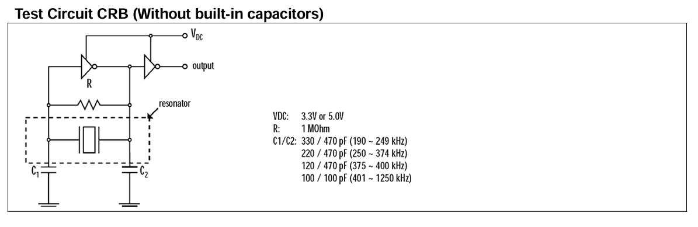

# Circuito oscilador
Circuito oscilador para o ressonador crb 455e:

O inversor utilizado na realimentação foi feito  utilizando o CD4007. Para o inversor de output, utilizou-se um dos inversores do CI SN74HC04 de modo a obter uma saída com tempos de subida e descida menores. Foram utilizadas capacitâncias de 100pF entre os terminais do ressonador e o terra e também uma capacitância de 86pF na saída do inversor de output, para redução da ondulação. 

Alternativamente,pode-se utilizar somente inversores do CI SN74HC04 ou similar para o oscilador. Para tanto, deve-se escolher capacitâncias maiores entre os terminais do ressonador e o terra, 100nF, por exemplo e também utilizar uma resistência de realimentação menor, 10kOhms, por exemplo. Essas mudanças estão ligadas  ao tipo de porta inversora. No CI SN74HC04 tem-se portas bufferizadas, enquanto que com o CD4007 faz-se portas não bufferizadas. 
